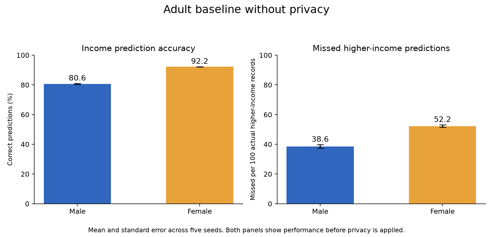

# Adult Phase 1: Non-Private Baseline

Completed seeds 0–4 (20 epochs each, SGD lr = 0.01). Values are **Mean ± Standard Error across 5 seeds**.

| Group | Test Accuracy (%) | Missed Higher-Income (> $50K) per 100 | Actual > $50K Prevalence |
| :--- | :---: | :---: | :---: |
| **Male** | 80.57 ± 0.39 | 38.57 ± 1.18 | 31.5% |
| **Female** | 92.18 ± 0.09 | 52.23 ± 0.85 | 11.6% |
| **Overall** | **86.33 ± 0.26** | **45.40 ± 0.81** | **21.6%** |

### Key Observation
- **The Accuracy Paradox**: Females show higher raw accuracy because 88.4% of females in the dataset earn ≤ $50K. Predicting the majority class inflates raw accuracy, but the model misses 52.2% of high-earning women vs. 38.6% of high-earning men.

