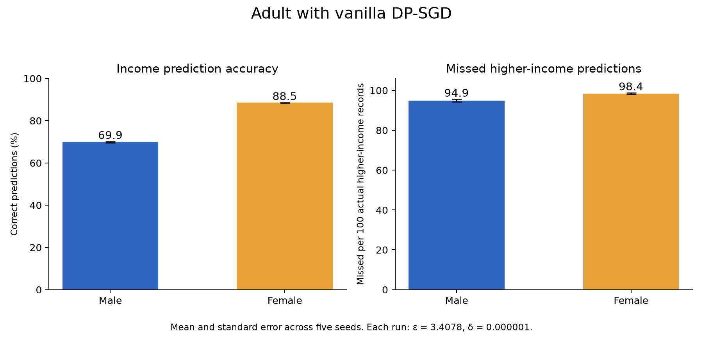

# Adult Phase 2: Vanilla DP-SGD Benchmark

Completed seeds 0–4 (20 epochs each, C = 0.5, σ = 1.0, ε = 3.41, δ = 10⁻⁶). Values are **Mean ± Standard Error across 5 seeds**.

| Group | Test Accuracy (%) | Accuracy Loss vs Baseline (pp) | Missed Higher-Income (> $50K) per 100 |
| :--- | :---: | :---: | :---: |
| **Male** | 69.86 ± 0.33 | 10.71 ± 0.33 | 94.95 ± 0.70 |
| **Female** | 88.54 ± 0.06 | 3.65 ± 0.08 | 98.43 ± 0.43 |
| **Overall** | **79.13 ± 0.22** | **7.20 ± 0.17** | **96.69 ± 0.49** |

### Key Observation
- **Severe Disparate Impact**: Adding privacy drops male accuracy by **10.71 pp** but female accuracy by only **3.65 pp**, creating a **7.07 pp disparity gap**.
- **Model Collapse on Minority Class**: DP noise causes the model to predict ≤ $50K for nearly all records, missing **95% to 98%** of high earners across both groups.

