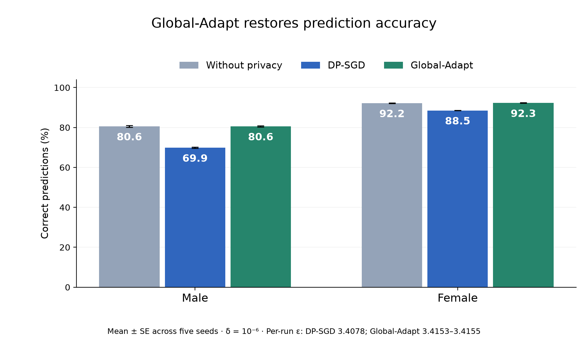
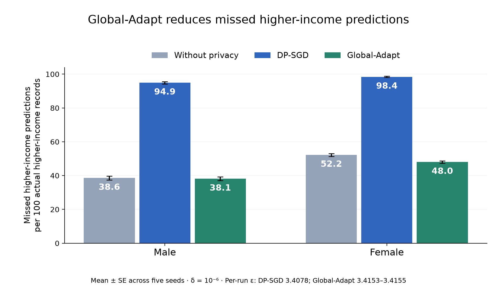

# Adult Phase 4: Final Three-Method Evaluation

Complete benchmark comparing **Non-private**, **Vanilla DP-SGD**, and **DPSGD-Global-Adapt** across 5 paired seeds (20 epochs each).

---

## 1. Summary Comparison

Values are **Mean ± Standard Error across 5 seeds**.

| Training Method | Privacy Budget (ε, δ) | Male Accuracy (%) | Female Accuracy (%) | Accuracy Loss Gap (Male − Female) | Missed > $50K per 100 |
| :--- | :---: | :---: | :---: | :---: | :---: |
| **Non-private Baseline** | None | 80.57 ± 0.39 | 92.18 ± 0.09 | Baseline | Male: 38.6 Female: 52.2 |
| **Vanilla DP-SGD** | ε = 3.41, δ = 10⁻⁶ | 69.86 ± 0.33 | 88.54 ± 0.06 | **+7.07 ± 0.28 pp** | Male: 95.0 Female: 98.4 |
| **DPSGD-Global-Adapt** | ε = 3.42, δ = 10⁻⁶ | 80.57 ± 0.26 | 92.29 ± 0.13 | **+0.10 ± 0.18 pp** | Male: 38.1 Female: 48.0 |

---

## 2. Key Findings

1. **Disparity Resolved**: Global-Adapt closes the accuracy loss gap from **7.07 pp to 0.10 pp** (near zero), matching the published paper benchmark (0.0 ± 0.1 pp).
2. **Utility Restored**: Both male (80.57%) and female (92.29%) accuracies return to baseline levels.
3. **High-Income Detection Recovered**: Missed high-income predictions recover to baseline rates without exceeding the privacy budget (ε = 3.42 vs 3.41).

---

## 3. Visualizations

